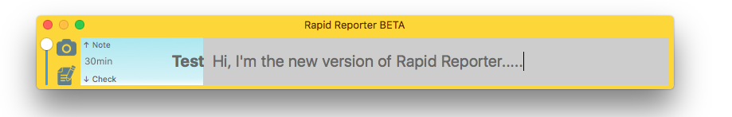

### Rapid Reporter BETA

Welcome to _Rapid Reporter BETA_. This is the first chance I've had to revisit the existing tool [RapidReporterMac](https://github.com/Skyscanner/RapidReporterMac) and take the chance to rewrite it, changing the visuals so it resembles the [original PC version](http://testing.gershon.info/reporter/) from Shmuel Gershon.

### Pre-Requisites

The Mac version requires you to be running OS X 10.11 (El Capitan) or above.

### Installation

To install Rapid Reporter BETA simply download the DMG file use that to install the application.

### What's New?

The aesthetics have been revamped like so....

.

I've also added the capability so it generates CSV **and** HTML output by default. No need to hand crank all that CSV data by hand now. As with the original, the HTML is customisable via your own `style.css` file.

### Mac Keyboard Shortcuts

The user interface layout is almost identical to that of the Windows original with a few aesthetic alterations due to OSX UI element support. One thing to note is the Rapid Reporter Mac support for Mac keyboard shortcuts, shown below:

| Shortcut | Action |
| :---: | :--- |
&#8984;&#8679; | Take screenshot of active screen |
&#8984;&#8679;S | Open Screenshot Utility   |
&#8984;N | Open New RTF Note |
&#8984;O | Open Working Folder in OSX Finder |
&#8984;[ | Decrease transparency |
&#8984;] | Increase transparency |
&#8984;- | Decrease session length |
&#8984;= | Increase session length |
&uarr; | Next note category |
&darr; | Previous note category |

### Output

The program saves it output to `~/Documents/Rapid Reporter Output/`. In there you can find your reports, RTF notes, and screenshots from each session that are named using timestamps.

### Issues

This is a BETA version so normal disclaimers apply. Please let me know if you come across any issues
